# Terminal2012

 Teknik Analiz ve Geliştirme Dökumanı

| **Hazırlayan** | Hasan YILDIRIM ( SAP/NET Danışmanı ) |
|----------------|--------------------------------------|
| **Email**      | hasanyildirim@hotmail.com            |
| **Yer**        | Gebze / KOCAELİ                      |
| **Tarih**      | 29.Mayıs.2014                        |
| **Version**    | v1.0                                 |

 ## [1] Programın Amacı :

 Hurda fabrikalarinda kullanilmak uzere, saha icinde mobil
 terminal cihazlari ile SAP nin MM ve SD modullerine girislerini saglayan
 arayuzler gelistirilmistir. Bu arayuzler sayesinde SAP ile entegrasyon
 kolaylasmistir. Malzeme yukleme ve indirmede, sayiminda, satis ve sevkiyatta
 surecler hizlanmistir.

 ## [2] Programın Geliştirilmesinde Kullanilan Yazılım Teknolojileri :

        | Gelistirme Ortami | Microsoft Visual Studio 2008 Team System |
        |-------------------|------------------------------------------|
        | Gelistirme Dili   | Visual C# 2.0                            |
        | NET Framework     | Compact Framework Version 1.0            |
        | Database          | Local DB kullanilmamistir                |
        | Visual Comps      | MS Standart Komponentler kullanilmistir  |
        | SAP Interface     | SOA Manager                              |

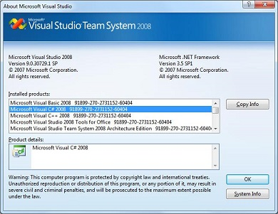

 ## [3] Programın Menusu :

 Programda cok farklı moduller icerdigi icin kullanicilarin rahat
 erisebilecegi bir menu sistemi tasarlanmistir. Bu menude MM ve SD adimlari,
 ayri basliklar altinda toplanmistir. Menulerde yetkilendirme kullanici ve
 profil bazlidir…

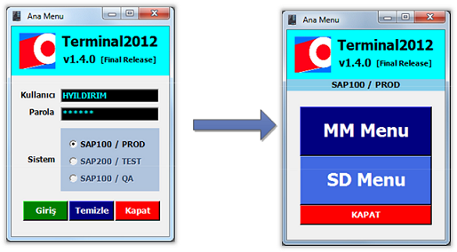

 **MM ve SD Menu Başlıklari :**

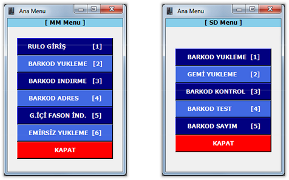

 ## [4] TEST ve QA Baglantisi :

 Uygulama ayni zamanda test muhendislerinin yeni modulleri ve gelistirmeleri
 test etmesi amaciyla SAP Test ve QA Clientlarinada baglanabilmektedir…

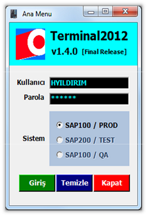

 Normal kullanicilara acik olmayan bu ozellige erisim icin, login ekraninda
 asagidaki key kombinasyonunu girmeniz gerekmektedir…

 **Ctrl +Shift + T**

 ## [5] Servise Yeni Eklenen Parametreler icin Yapılacaklar :

 Bazen ihtiyac geregi, SOAManager tanimlı function module yeni parametreler
 eklemek ve cikartmak gerekebilir. Boyle durumlarda asagidaki isemlerin
 mutlaka yapilmasi sarttir. Aksi takdirde SAP tarafinda bozulmus bir servis
 katmani olusur ve terminal clientlarin uygulamaya erismesi bozulabilir..

 **SE80** den Enterprise servislerin altindaki altina atiyoruz.. Daha sonra
 bu requesti sisten tekrar duzelmis oluyor..

**Soa Servisleri,** yeniden derleyip bir **Request** in once QA sonra PROD a
aliyoruz… Boylece, canli

 ## [6] SOA Manager :

 Butun uygulamarda kantar ve terminal dahil, SAP ile iletisimi SOAManagerda
 tanimlanan servisler uzerinden yapiyoruz. Bu nedenle SOAManageri anlamak ve
 servislerin nasil yaratildigini bilmek onem arzetmektedir…

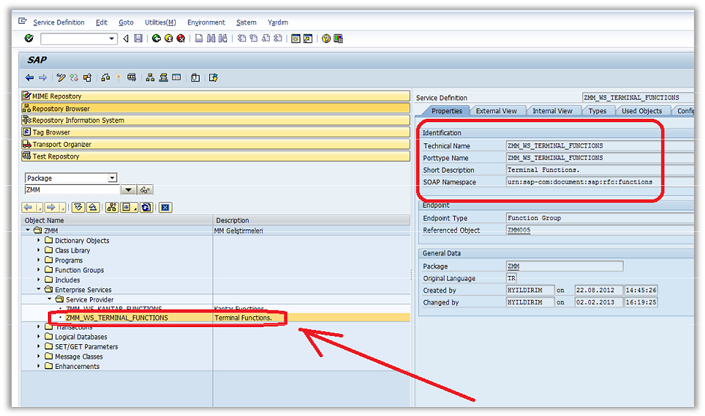

 **SOA Manager da Servis Nasıl Tanımlanır ?**

 SoaManager dan Create edilen butun servisleri WEBUSER kullanarak
 gerceklestirilmistir...

 Boylece bir hata ciktiginda veya debug ihtiyaci oldugunda, bu isimle akisi
 filtreeleriz...

 Boylece servis cagrilarinin yonetimi kolay olur.

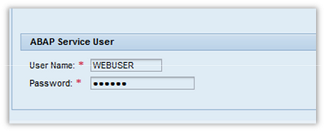

 **A) Create New Service :**

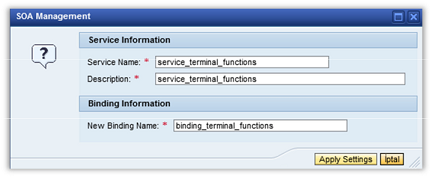

 **B) Servis Config :**

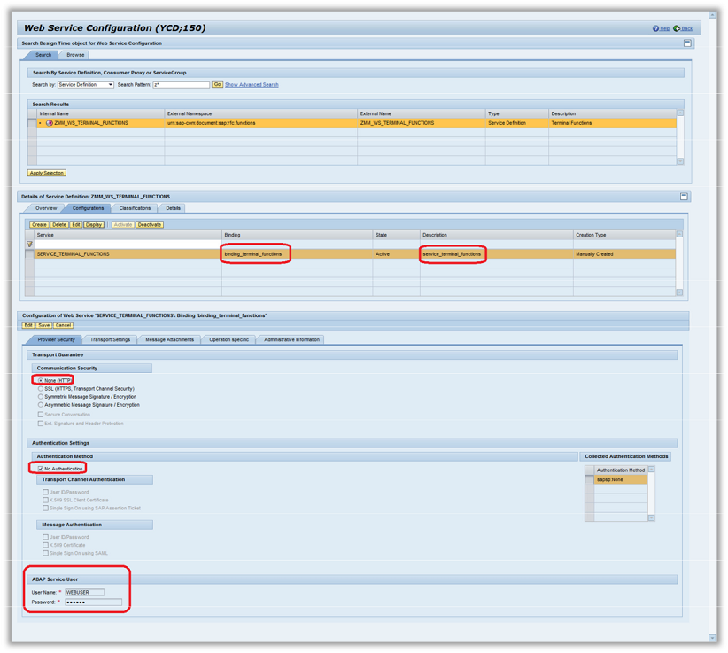

 **Communication Security: None (HTTP only)**

 İletisim guvenlik parametresi olarak None i seciyoruz. Kapali bir networkte
 oldugumuz icin ve https sertifikalara ekstra maliyet ayirmamak icin en basit
 guvenlik modunu seciyoruz.

 **Authentication Settings - Transport Channel Authentication :
 UserID/Password**

 SSL ceritifkasi kullanmadigimiz icin dogrulama ayarlarinda da daha onceden
 belirledigimiz sabit kullanici ve sifre ile baglantiyi gerceklestiriyoruz.
 Kullanilan user in kesinlikle uzaktan erisim yetkisinin bulunmasi gerekiyor.

 **Servis Adresi :**

 **http://ycbrprd.borugrup.local:8000/sap/bc/srt/wsdl/srvc_515943AB4BFE2
 AD0E10080000A100232/wsdl11/allinone/ws_policy/document?sap-client=100**

 **Servis Gövdesi :**

 WSDL (Web Service Description Language) ile gosterilen servis govdesini,
 herhangi bir tarayici ile acip, icerigini inceleyebilirsiniz… Servis icin
 kullanilan butun parametreler, veri tipleri, kullanilan fonksiyon moduller
 ve donus degerleri, kisacasi servis ile ilgili hersey bu servis govdesinde
 yer almaktadir.

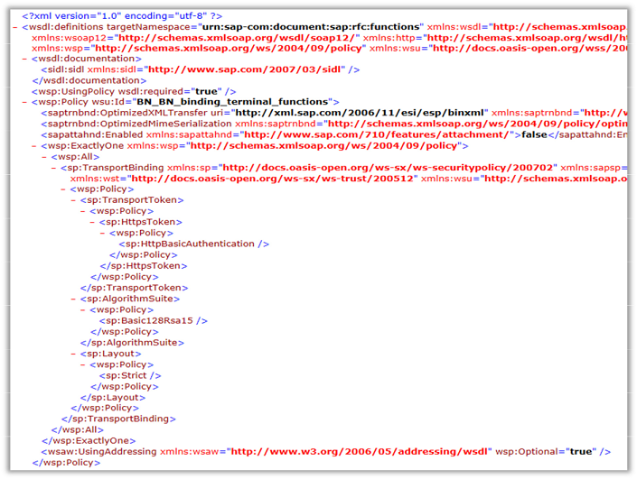

 Bu tanimlari kullanarak, istedigimiz bir uc client gelisitirebiliriz… Java /
 .NET veya bu projede oldugu gibi bir terminal uygulamasi gelistirebiliriz…
 Yazilan serviste herhangi bir sorun ile karsilasirsak, sorunu incelemek icin
 asagidaki destekleyici araclarin kullanilmasi tavsiye edilir.

 **SOAPUI:** Soap tabanli servislerin test ortaminda calistirilmasi ve
 sonuclarinin degerlendirilmesi icin gerekli bir test tooludur.

 **http://www.soapui.org/**

 **FIDDLER:** Yine web uzerinden calisan arayuzlerin arka taraftaki
 degerlerini yakalamak icin onemi bir Debug tooludur. Bu gelistirlen
 servisleri incelemek icin onemli bir aractir.

 **http://www.telerik.com/fiddler**

 ## [7] Terminal Fonksyionlari :

 Terminal fonksiyonlarini SAPGUI’ de **SE80** ekranina girdikten sonra
 **ZMM** paketi altinda gorebilirsiniz. Bu fonksiyonlarin yapisini daha sonra
 ayrintili olarak inceleyecegiz…

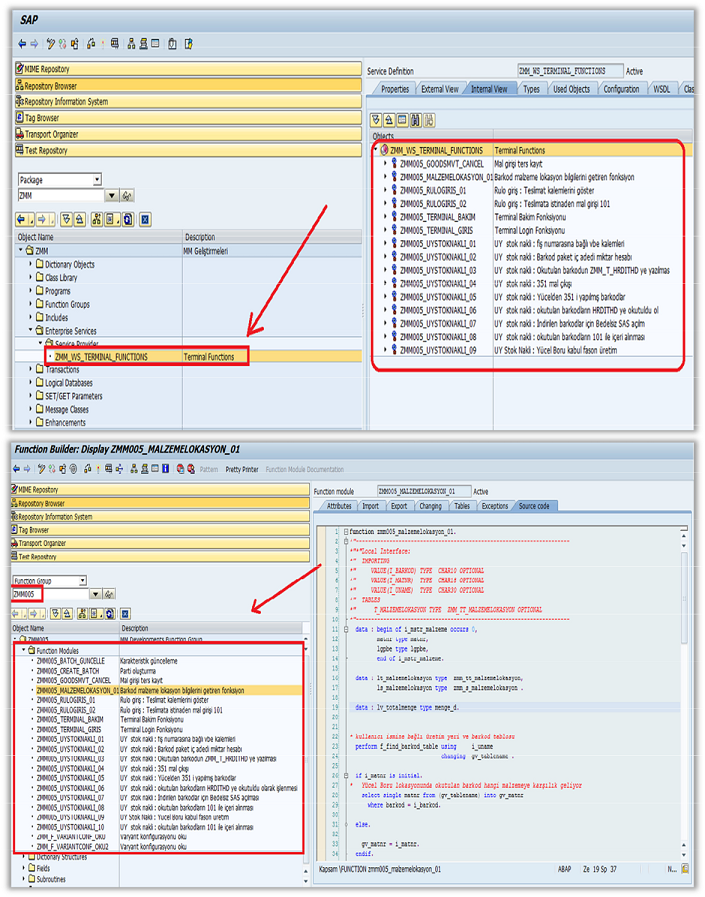

 ## [8] Terminal Emilasyon Ayarları :

 Visual Studio 2008 ortaminda mobil uygulama gelistirirken, en cok
 ihtiyacimiz olan sey, ortaya cikan exe nin gercek bir mobil cihazda
 calistirilmasidir. Yeni olusan exe nin surekli bir cihaza kopyalanmasi ve
 uzerinde calistirilmasi zaman alan bu surectir. Bu nedenle gelistirme ortami
 ile beraber gelen Emulasyon arayuzunden faydalaniriz. Bu bize gercek bir
 makina da calistirma sansi verir. Uygulamayi run etmeden once yapmaniz
 gereken ayarlar asagidaki gibidir:

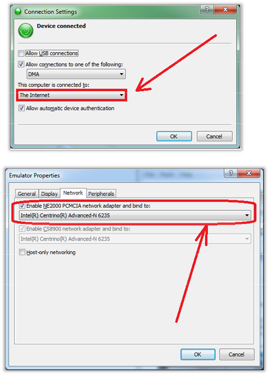

 ## [9] SOAManager in Web Browser da Açılmama Sorunu :

 Bazi makinalarda SOAManager servis tanimlama arayuzune web uzerinden
 erismekte sorun yasanabiliniyor. Bu tur durumlarda sorunu asabilmek icin
 asagidaki configurasyonu, bilgisayarinizdaki HOST dosyasinda uygulamamiz
 gerekiyor. Bu islemden sonra sorunuz erisim saglanacaktir…

 **10.16.2.47 ycbrdev01.boru**

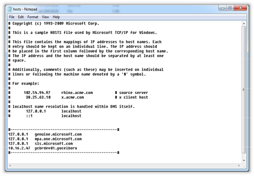

 ## [10] Terminal Uygulamalari Otomatik Dagitim ve Yonetim Modulu :

 Terminal uygulamalarimizi otomatik dagitim ve yonetimini saglayan modulun
 calisma sekli asagidaki gibidir. Bu modul sayesinde Terminal uzerinde
 calisan uygulama, otomatik olarak guncellenir. Terminaller uzerinde calisan
 uygulamalar, merkezi bir yerden yonetilir. Uygulamari istediginiz sekilde
 acip kapatma imkani saglar. Ayni zamanda version yukseltme ve geri alma
 (rollback) imkani saglar.

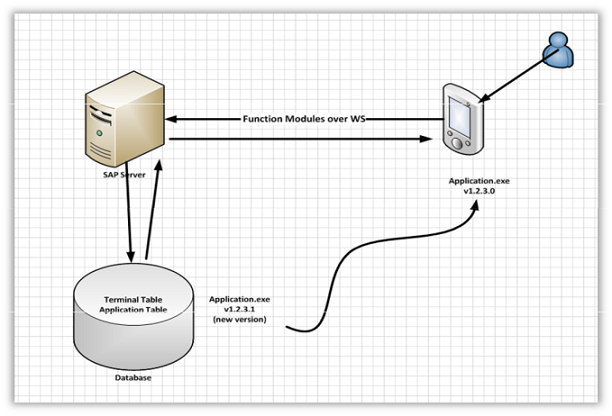

 Bu modulun calismasi icin gerekli tablo tanimlari ve bu tablolarda
 kullanilan alanlarin detaylari asagidaki gibidir…

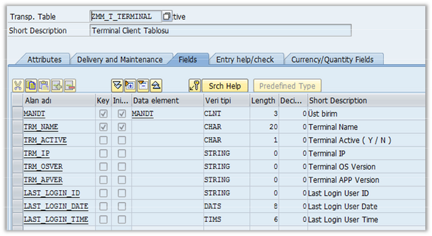

 Bu tablolarda ayrica, en son login olmus cihazlar, baglanti detaylari,
 uzerlerinde calisan uygulamanin versionu bulunmaktadir.. Guncel versionu
 olmayan mobil cihazi icin otomatik olarak uyari mesaji verilir…

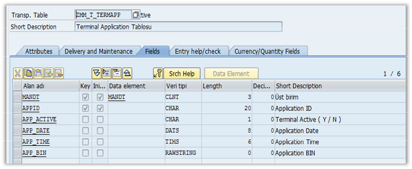

 Saha icinde yayilmis butun mobil cihazlarini takip etmek icin bu ortak alan
 sistem yoneticilerinin isini kolaylastirmakla beraber, sistemi daha rahat
 izleme sansi verecektir.

 ## [11] Ornek Bir Modul Ekranı :

1.  *Operator Fisno yu girdikten sonra Listele butonuna basarak ilgili emrin
    kalemlerini getirir...*

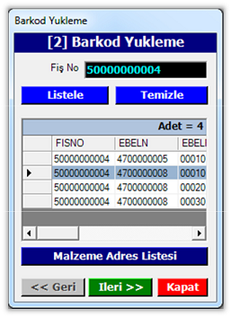

1.  *Daha sonra operatorun sectigi kalem ile ILERI butonu tiklayarak yukleme
    sayfasini acar. Bu sayfada hem Barkod yukleme hemde silme islemini
    gerceklestirir.*

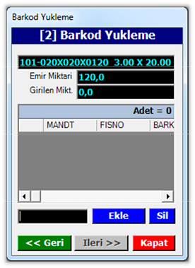

 ## [12] NET Uygulamasindan SOA Servisinin Cagrilması :

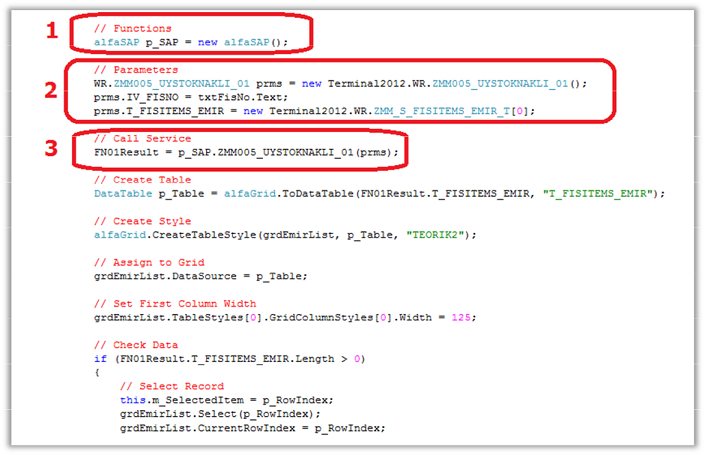

 Genel olarak bir SOA servisinin calisma mantigi su sekildedir:

1.  Web Rereference olarak aldigimiz class uzerinden objeyi yaratiriz.

2.  Daha sonra Obje uzerinde cagiracagimiz Fonksiyonun Parametrelerini
    hazirlariz.

3.  Son olarak parametreleri gecerek fonksiyonu cagirabiliriz.

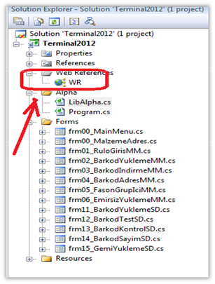

 ## [13] Windows ve Terminal Ortamindaki Farklar :

 VSNET2008 toolu ile gelistirdigimiz mobile uygulama exeleri her ne kadar
 windows ortaminda calissada, mobilya cihazdaki ayni arayuzu vermemektedir.
 Bu nedenle testlerde bir yanilgi olmamasi adina bir ornek veriyorum…

 Ornegin, PC ortaminda edit modu acik olan bir liste, gercek cihaz uzerinde
 readonly modda olacaktir. Bu tur detaylari test muhendislerinin not etmesi
 gerekmektedir.

 **Terminal Ortami**

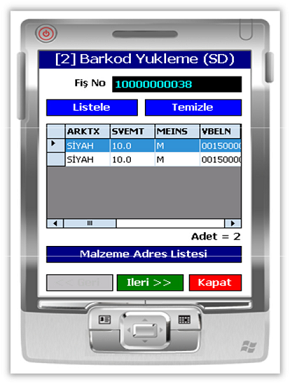

 **PC Windows Ortami**

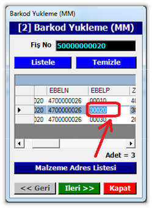

 ## [14] Malzeme Sayım Modulu :

1.  **SAYIM ON BİLGİ EKRANİ ( Burda istif header kaydi aliniyor )**

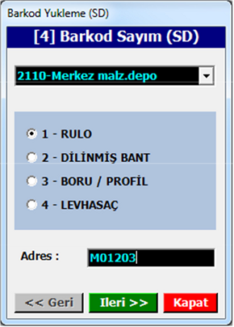

1.  **BARKOD GİRİŞ ( Barkodlar, burda tek tek giriliyor )**

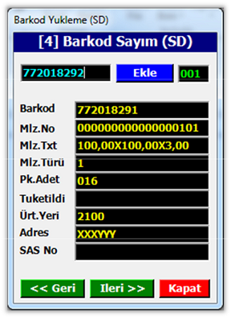

1.  **LİSTELEME ( Butun girilen barkodlarin listesi, Istif Rapor ekrani )**

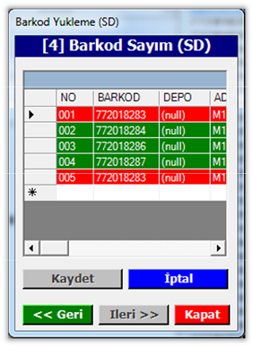

 Kritik modullerden biri olan MALZEME sayım modulu hem Cayirova hemde
 Boru grubu tarafindan kullanilmaktadir. Yıl sonu yapilan fabrika envanter
 sayiminda terminal cihazlarinin kullanimi sureci hizlandirmakta ve elde
 edilen istatistiklerin guvenilirliligini artirmaktadir. Ayrica sayim
 degerleri local olarak cihaz uzerinde tutulmayip, aninda SAP server uzerinde
 guncellenmektedir…

 ## [15] Şartlara Uygun Gridlerin Renklendirilmesi :

 **Conditional formatting in a DataGrid ( Compact Framework )**

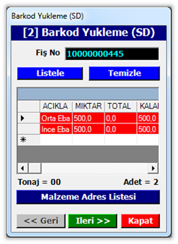

Kullanicilardan gelen istek uzerine, grid listelerinde bazi degerlere gore
kalemlerin renklendirilmesi gerekti. Malesef standart .Net Compact Framework
kutuphanesinde boyle bir ozellik olmadigi icin bunun icin ozel bir class
yazilmistir… Bu Class in detaylarini asagida bulabilirsiniz…

 ```csharp
public class alfaGrid
{
    //--------------------------------------------------------------------------------------------------------------------------------------------------------//

    public static void CreateTableStyle(DataGrid p_Grid, DataTable p_Table)
    {
        // Clear
        p_Grid.TableStyles.Clear();

        // Create TableStyle
        DataGridTableStyle tableStyle = new DataGridTableStyle();

        // MappingName
        tableStyle.MappingName = p_Table.TableName;
        foreach (DataColumn colTable in p_Table.Columns)
        {
            // Create ColStyle
            AlfaColumn colStyle = new AlfaColumn(p_Grid);

            //Assign Values 
            colStyle.Width = 50;
            colStyle.MappingName = colTable.ColumnName;
            colStyle.HeaderText = colTable.ColumnName;

            //Add ColStyle 
            tableStyle.GridColumnStyles.Add(colStyle);
        }

        // Add TableStyle
        p_Grid.TableStyles.Add(tableStyle);
    }

    //--------------------------------------------------------------------------------------------------------------------------------------------------------//

    public static DataTable ToDataTable<T>(IList<T> data, string p_TableName)
    {
        PropertyDescriptorCollection props = TypeDescriptor.GetProperties(typeof(T));

        // DataTable
        DataTable table = new DataTable();

        //Set TableName 
        table.TableName = p_TableName;

        for (int i = 0; i < props.Count; i++)
        {
            PropertyDescriptor prop = props[i];
            table.Columns.Add(prop.Name, prop.PropertyType);
        }

        object[] values = new object[props.Count];
        foreach (T item in data)
        {
            for (int i = 0; i < values.Length; i++)
            {
                values[i] = props[i].GetValue(item);
            }

            // Add Row                                                 
            table.Rows.Add(values);
        }

        return table;
    }

    //--------------------------------------------------------------------------------------------------------------------------------------------------------//

    public class AlfaColumn : DataGridTextBoxColumn
    {
        // DataGrid                                                
        DataGrid m_Grid = null;

        // AlfaColumn                                              
        public AlfaColumn(DataGrid p_Grid)
        {
            this.m_Grid = p_Grid;
        }

        protected override void Paint(Graphics g, Rectangle Bounds,CurrencyManager Source, int RowNum, Brush BackBrush, Brush ForeBrush, bool AlignToRight)
        {
            // Define Brush                                            
            Brush m_BackBrush, m_ForeBrush;
            m_BackBrush = new SolidBrush(Color.Red);
            m_ForeBrush = new SolidBrush(Color.White);

            // Call Base Function                                      
            base.Paint(g, Bounds, Source, RowNum,
            m_BackBrush, m_ForeBrush, AlignToRight);
        }
    }

    //--------------------------------------------------------------------------------------------------------------------------------------------------------//
}
```
